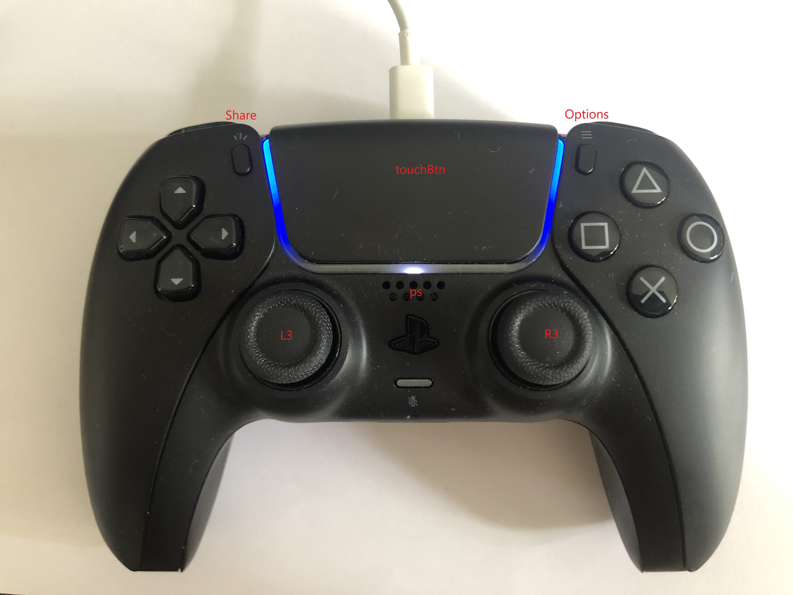

# ds5_ros

A ROS1 Node to integrate the DualSense 5 (PS5) Controller into the ROS ecosystem, including feedback messages to set leds, adaptive triggers etc.

# Installing

Install the hidapi.

```bash
sudo apt install libhidapi-dev
```
Install the package from [pypi](https://pypi.org/project/pydualsense/).

```bash
pip install pydualsense
```

To run the package node
```bash
sudo su root
```

OR

```bash
sudo chmod -R 777 /dev
```


# Usage

Initialize the controller

```python
from pydualsense import *

ds = pydualsense() # open controller
ds.init() # initialize controller
```

Close the controller

```python
ds.close() 
```


## LED

Set color RGB. RGB are integer values and in range 0-255.

```python
ds.light.setColor(255, 0, 0)
```
## Rumble effect

Control the rumble effect of left motor or right motor. Intensity is in range 0-255.

```python
ds.setLeftMotor(255)
```
## Adaptive Trigger

Set trigger mode for the buttons and control the intensity.

```python
ds.TriggerR.setMode(TriggerModes.Rigid)
ds.TriggerR.setForce(1, 255)
```
## Other

Other effects and enumerations could be found under pydualsense.py and enums.py

# Topic

## Publisher
Joy
- Topic: joy
- Message type: [Joy](https://docs.ros.org/en/api/sensor_msgs/html/msg/Joy.html)


## Subscriber

Joy feedback
- Topic: joy/set_feedback
- Message type: [JoyFeedbackArray](http://docs.ros.org/en/api/sensor_msgs/html/msg/JoyFeedbackArray.html)

# Controler Mapping

## Button

buttons[0] = cross

buttons[1] = circle

buttons[2] = triangle 

buttons[3] = square

buttons[13] = cross up

buttons[16] = cross right

buttons[14] = cross down

buttons[15] = cross left

buttons[6] = rear left 2 button

buttons[7] = rear right 2 button

buttons[4] = rear left 1

buttons[5] = rear right 1

buttons[8] = stick left button

buttons[9] = stick right button

buttons[10] = PS

buttons[11] = share

buttons[12] = options

buttons[17] = track pad button



## Axes

joy_msg.axes[0] = stick left    leftward (-1.0 -> 1.0, default ~0.0)

joy_msg.axes[1] = stick left    upward (-1.0 -> 1.0, default ~0.0)

joy_msg.axes[2] = stick right   leftward (-1.0 -> 1.0, default ~0.0)

joy_msg.axes[3] = stick right   upward (-1.0 -> 1.0, default ~0.0)

joy_msg.axes[4] = rear left 2   pushDown (0.0 -> 1.0, default = 0)

joy_msg.axes[5] = rear right 2  pushDown (0.0 -> 1.0, default = 0)


Other controll function like touch pad can be found in pydualsense.py

# Credits

[https://github.com/flok/pydualsense](https://github.com/flok/pydualsense)
